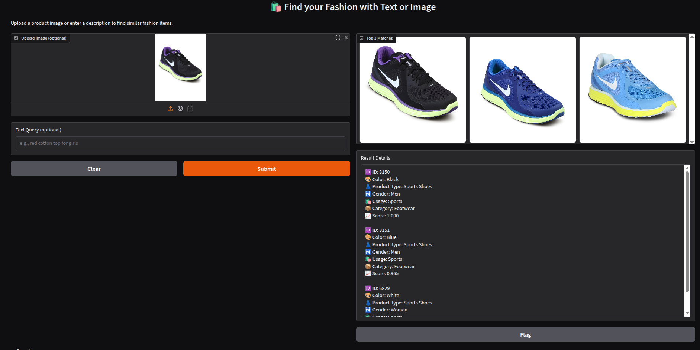
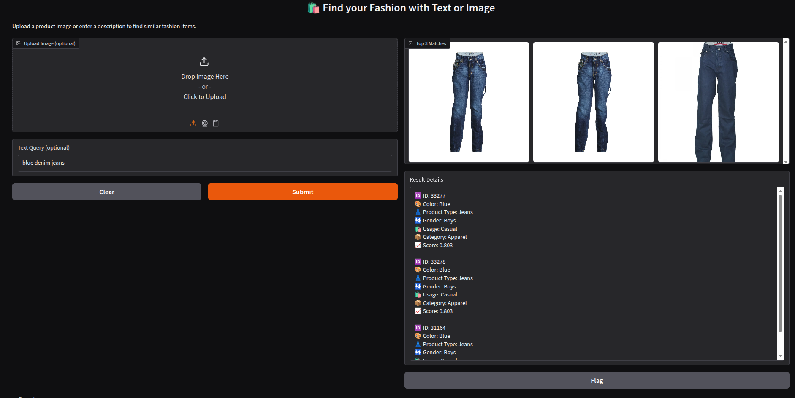
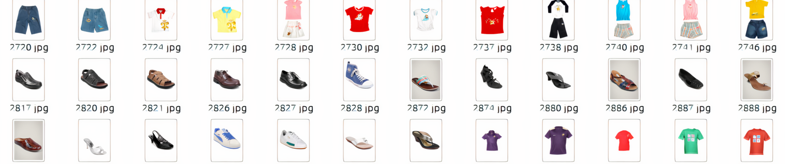
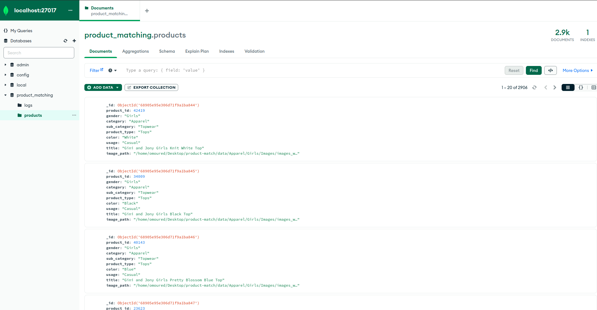
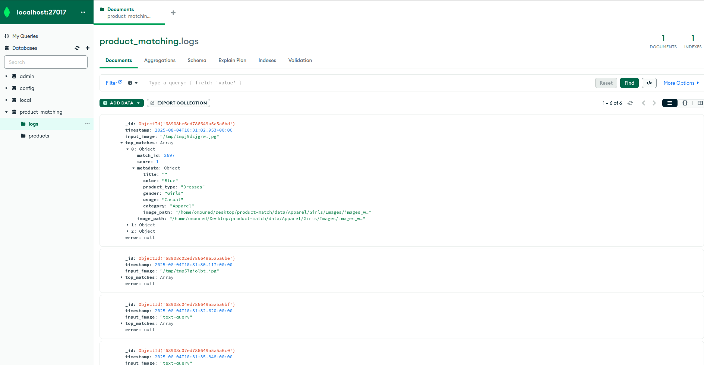

# 🛍️ Fashion Search Engine (Image + Text)

<div align="center">
  <a href="https://huggingface.co/spaces/omoured/fashion-search-engine">
    
  </a>
</div>

This project provides an efficient way to search fashion products using either an image or a textual description. Users can search either by uploading an image or entering a descriptive text query, and the system will return visually or semantically similar fashion items.

Powered by **OpenAI’s CLIP ViT-B/32** model and accelerated using ONNX and FAISS for real-time retrieval.

---

<div align="center">
  
  
</div>

<p align="center"><em>Example UI: Left - Image-based Search, Right - Text-based Search</em></p>

---

## 🧠 Model Details

To accelerate inference, we export both the **visual** and **text** encoders to **ONNX** format. Our benchmark results (`test_onnx.py`) demonstrate a **~32× speedup** using ONNX Runtime compared to the original PyTorch models.

- **Model:** `ViT-B/32` (OpenAI CLIP)
- **Backends:**
  - Image encoder → ONNX
  - Text encoder → ONNX
- **Inference engine:** `onnxruntime`
- **Indexing:** `FAISS` with L2-normalized vectors
- **Benchmark:** ~32x speedup (measured on CPU using `test_onnx.py`)

---

## 🛠️ Installation & Setup

### 1. Environment Setup

```bash
conda create -n product-match python=3.10
conda activate product-match
pip install -r requirements.txt
```

Make sure MongoDB is running locally at `mongodb://localhost:27017` before continuing.

---

### 2. 🗂️ Dataset Preparation

To experminet with this system we used [E-commerce Product Images ](https://www.kaggle.com/datasets/vikashrajluhaniwal/fashion-images)dataset from Kaggle. Run the following scripts to prepare the fashion dataset:

```bash
# Download and structure the dataset
python get_dataset.py
# Augment product image path to the fashion.csv
python update_csv.py
```

<div align="center">
  
</div>

<p align="center"><em>Example samples from the Kaggle E-commerce Product Images dataset</em></p>

---

### 3. 🧾 Generate Embeddings

From the `app/faiss/` directory:

```bash
# Generate CLIP text embeddings from product descriptions
python generate_text_embeddings.py

# Generate CLIP image embeddings from product images
python generate_visual_embeddings.py
```

These scripts will output `.csv` embedding files under `data/`.

---

### 4. 🧠 Build FAISS Index

Navigate to the `app/faiss/` directory and run the following script to build indexes for fast similarity search:

```bash
python build_faiss_index.py
```

This script will generate:

* `faiss_image.index` – FAISS index for image embeddings
* `faiss_text.index` – FAISS index for text embeddings
* `image_id_to_meta.pkl` – metadata mapping for image results
* `text_id_to_meta.pkl` – metadata mapping for text results

These files are required for the search engine to return relevant product matches.

---

### 5. 🗃️ MongoDB Setup

Set up the MongoDB database for logging inference queries and results:

```bash
cd app/db/
python mongo_setup.py
```

This script will:

* Connect to `mongodb://localhost:27017`
* Create a database named `product_matching`
* Initialize a collection called `logs`

This collection will automatically store:

* Input query details (text or image)
* Top matching results with metadata
* Any runtime errors encountered during inference

⚠️ Make sure MongoDB is installed and running locally before executing this step.


<div align="center">
  
  
</div>

<p align="center"><em>Screenshots from the database logs and products.</em></p>

You can monitor logs using a MongoDB GUI like MongoDB Compass or via shell:

```bash
mongo
use product_matching
db.logs.find().pretty()
```

---

### 6. 🧪 Launch the Gradio Demo UI

After preparing the dataset, embeddings, FAISS indexes, and MongoDB, you can launch the interactive demo:

```bash
python app/ui/gradio_search.py
```

Once the script runs, Gradio will start a local web server and display a URL. You're now ready to explore and experiment with multi-modal product search. 🎯

---

## 📄 References & Licensing

This project was developed as part of **Omar Moured's job application** for a position at [Sereact.ai](https://sereact.ai/).

The code, data processing scripts, and UI implementation provided in this repository are **not intended for public distribution or reuse**.

All content is protected under a Creative Commons Attribution-NonCommercial-NoDerivatives 4.0 (CC BY-NC-ND 4.0).
